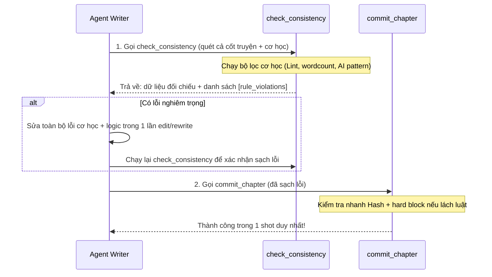

# Kế Hoạch Cải Tiến: Tối Ưu Hóa Quy Trình Kiểm Tra Nhất Quán (Consistency Check) & Tránh Vòng Lặp Sửa Lỗi Trễ

## 1. Vấn Đề Hiện Tại
Hệ thống hiện tại tồn tại điểm nghẽn phản hồi chất lượng trễ (Late Feedback Loop) giữa các công cụ viết chương:
1. **Phản hồi trễ**: Agent Writer không biết trước các lỗi cơ học (từ cấm, số từ tối thiểu, lặp câu AI...) trong bước `check_consistency`. Lỗi chỉ được phát hiện ở bước cuối cùng (`commit_chapter`).
2. **Lãng phí token & request**: Khi bị chặn ở `commit_chapter`, Agent buộc phải chạy lại chuỗi: `edit_chapter` -> `check_consistency` (để khớp SHA256 digest mới) -> `commit_chapter`.
3. **Lỗi dây chuyền**: Writer cố sửa nhanh bằng `edit_chapter` nhưng dễ bị lệch whitespace/newline dẫn đến lỗi `apply edit: could not find exact text`.

---

## 2. Giải Pháp Tối Ưu
Chuyển dịch toàn bộ logic kiểm tra cơ học từ bước **Cuối cùng** (Commit) lên bước **Kiểm tra** (Consistency Check) dưới dạng thông báo chẩn đoán không chặn (Non-blocking Diagnostic), đồng thời giữ `commit_chapter` làm chốt chặn bảo mật cuối (Hard Gate).



---

## 3. Kế Hoạch Chi Tiết & Tác Động Code

### A. Tái Cấu Trúc Bộ Kiểm Tra (Shared Rules Checker)
Tạo hoặc trích xuất hàm kiểm tra cơ học dùng chung để cả hai công cụ cùng gọi, đảm bảo tính đồng bộ tuyệt đối về luật kiểm tra.

### B. Cấu Hình `check_consistency.go`
1. Bổ sung `rulesOpts rules.LoadOptions` vào struct `CheckConsistencyTool`.
2. Hỗ trợ phương thức thiết lập `.WithRules(opts rules.LoadOptions)`.
3. Trong `Execute`:
   - Chạy bộ kiểm tra cơ học trên nội dung bản nháp.
   - Trả về danh sách `rule_violations` trong kết quả JSON (dưới dạng cảnh báo, không gây lỗi trả về của tool).

```go
type CheckConsistencyTool struct {
 	store *store.Store
	rulesOpts rules.LoadOptions
}

func (t *CheckConsistencyTool) WithRules(opts rules.LoadOptions) *CheckConsistencyTool {
	t.rulesOpts = opts
	return t
}
```

### C. Đăng Ký Cấu Hình Trong `internal/agents/build.go`
Truyền `rulesOpts` khi khởi tạo `CheckConsistencyTool` tại hàm dựng agent.

```go
	writerTools := []agentcore.Tool{
		contextTool,
		readChapter,
		tools.NewPlanChapterTool(store),
		tools.NewDraftChapterTool(store),
		tools.NewEditChapterTool(store),
		tools.NewCheckConsistencyTool(store).WithRules(rulesOpts),
		tools.NewCommitChapterTool(store).WithRules(rulesOpts),
	}
```

### D. Giữ Chốt Chặn Bảo Vệ Tại `commit_chapter.go`
`CommitChapterTool` vẫn giữ nguyên logic chặn cứng (`SeverityError` -> trả về lỗi) để đảm bảo Agent không bypass hoặc bỏ qua cảnh báo lỗi cơ học nghiêm trọng trước khi ghi xuống cơ sở dữ liệu.
